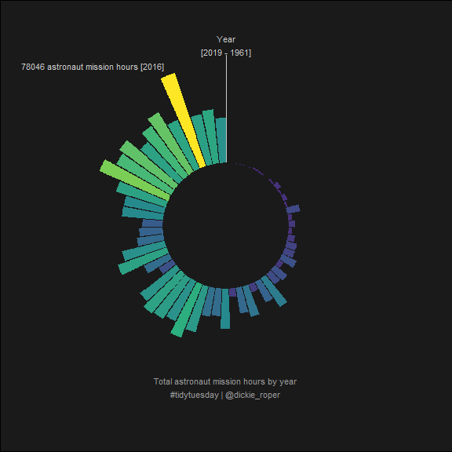
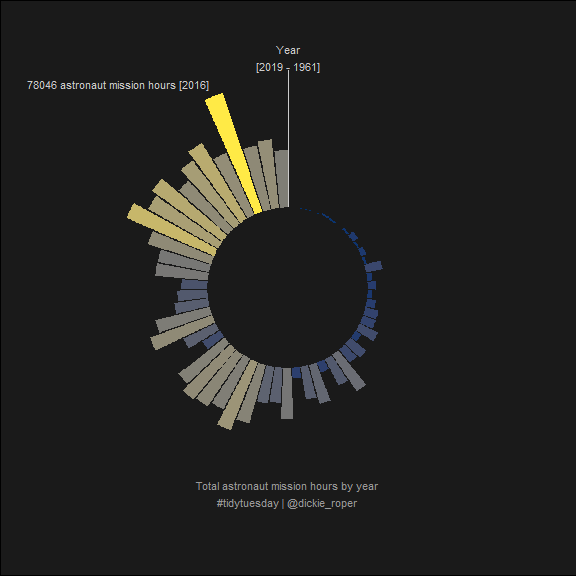
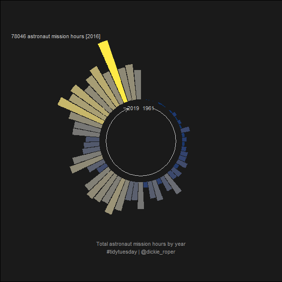

Astronaut database
================

## TidyTuesday \[2020-07-14\]

``` r
library(tidytuesdayR)
library(tidyverse)
```

A quick look at the data set

``` r
d <- tidytuesdayR::tt_load("2020-07-14")[[1]]
#> --- Compiling #TidyTuesday Information for 2020-07-14 ----
#> --- There is 1 file available ---
#> --- Starting Download ---
#> 
#>  Downloading file 1 of 1: `astronauts.csv`
#> --- Download complete ---
```

``` r
glimpse(d)
#> Rows: 1,277
#> Columns: 24
#> $ id                       <dbl> 1, 2, 3, 4, 5, 6, 7, 8, 9, 10, 11, 12, 13,...
#> $ number                   <dbl> 1, 2, 3, 3, 4, 5, 5, 6, 6, 7, 7, 7, 8, 8, ...
#> $ nationwide_number        <dbl> 1, 2, 1, 1, 2, 2, 2, 4, 4, 3, 3, 3, 4, 4, ...
#> $ name                     <chr> "Gagarin, Yuri", "Titov, Gherman", "Glenn,...
#> $ original_name            <chr> "<U+0413><U+0410><U+0413><U+0410><U+0420><U+0418><U+041D> <U+042E><U+0440><U+0438><U+0439> <U+0410><U+043B><U+0435><U+043A><U+0441><U+0435><U+0435><U+0432><U+0438><U+0447>", "<U+0422><U+0418><U+0422><U+041E><U+0412> <U+0413><U+0435><U+0440><U+043C><U+0430><U+043D> <U+0421>...
#> $ sex                      <chr> "male", "male", "male", "male", "male", "m...
#> $ year_of_birth            <dbl> 1934, 1935, 1921, 1921, 1925, 1929, 1929, ...
#> $ nationality              <chr> "U.S.S.R/Russia", "U.S.S.R/Russia", "U.S."...
#> $ military_civilian        <chr> "military", "military", "military", "milit...
#> $ selection                <chr> "TsPK-1", "TsPK-1", "NASA Astronaut Group ...
#> $ year_of_selection        <dbl> 1960, 1960, 1959, 1959, 1959, 1960, 1960, ...
#> $ mission_number           <dbl> 1, 1, 1, 2, 1, 1, 2, 1, 2, 1, 2, 3, 1, 2, ...
#> $ total_number_of_missions <dbl> 1, 1, 2, 2, 1, 2, 2, 2, 2, 3, 3, 3, 2, 2, ...
#> $ occupation               <chr> "pilot", "pilot", "pilot", "PSP", "Pilot",...
#> $ year_of_mission          <dbl> 1961, 1961, 1962, 1998, 1962, 1962, 1970, ...
#> $ mission_title            <chr> "Vostok 1", "Vostok 2", "MA-6", "STS-95", ...
#> $ ascend_shuttle           <chr> "Vostok 1", "Vostok 2", "MA-6", "STS-95", ...
#> $ in_orbit                 <chr> "Vostok 2", "Vostok 2", "MA-6", "STS-95", ...
#> $ descend_shuttle          <chr> "Vostok 3", "Vostok 2", "MA-6", "STS-95", ...
#> $ hours_mission            <dbl> 1.77, 25.00, 5.00, 213.00, 5.00, 94.00, 42...
#> $ total_hrs_sum            <dbl> 1.77, 25.30, 218.00, 218.00, 5.00, 519.33,...
#> $ field21                  <dbl> 0, 0, 0, 0, 0, 0, 0, 0, 0, 0, 0, 0, 0, 0, ...
#> $ eva_hrs_mission          <dbl> 0.00, 0.00, 0.00, 0.00, 0.00, 0.00, 0.00, ...
#> $ total_eva_hrs            <dbl> 0.00, 0.00, 0.00, 0.00, 0.00, 0.00, 0.00, ...
```

First thought, what is the difference in time between when an astronaut
is first selected and when they go on their first mission? How does it
vary by nationality?

``` r
d %>% 
  filter(mission_number == 1) %>% # first mission
  mutate(age_at_selection = year_of_selection - year_of_birth,
         age_at_first_mission = year_of_mission - year_of_birth,
         diff = age_at_first_mission - age_at_selection) %>% 
  group_by(nationality) %>% 
  filter(n() > 20) %>% # Select high count nationalities
  gather(k, v, age_at_selection, age_at_first_mission, diff) %>% 
  mutate(k_pretty = case_when(k == "age_at_selection" ~ "Age at selection year",
                              k == "age_at_first_mission" ~ "Age at first mission",
                              k == "diff" ~ "Difference",
                              TRUE ~ "Error")) %>% 
  ggplot()+
  geom_histogram(aes(v, ..density.., fill=k_pretty), 
                 position = "identity", 
                 alpha=1/2, binwidth = 1, center=0)+
  facet_wrap(~nationality, scales = "free_y", ncol=1)+
  scale_fill_viridis_d("")+
  scale_x_continuous(breaks=scales::pretty_breaks(10))+
  theme(legend.position = "bottom")+
  labs(title = "First mission - distribution of age at selection-year and age at mission-year",
       subtitle = "Facetted by the two biggest astronaut nationalities",
       x = "Age [years]",
       y = "Density estimate")
```

<!-- -->

## Astronaut hours by year

Here I will begin by re defining `coord_munch()` in order to have higher
resolution polygons when using polar coordinates. This hack is taken
from
[here](https://stackoverflow.com/questions/9483033/increase-polygonal-resolution-of-ggplot-polar-plots)

``` r
# Save the original version of coord_munch
coord_munch_old <- ggplot2:::coord_munch

# Make a wrapper function that has a different default for segment_length
coord_munch_new <- function(coord, data, range, segment_length = 1/500) {
  coord_munch_old(coord, data, range, segment_length)
}

# Make the new function run in the same environment
environment(coord_munch_new) <- environment(ggplot2:::coord_munch)

# Replace ggplot2:::coord_munch with coord_munch_new
assignInNamespace("coord_munch", coord_munch_new, ns="ggplot2")
```

Summarise data by summing mission hours per year of mission

``` r
pd <-
  d %>% 
  group_by(year_of_mission) %>% 
  summarise(year_hours = sum(hours_mission)) %>% 
  mutate(text_label = case_when(year_hours == max(year_hours) ~ 
                                  glue::glue("{round(year_hours)} astronaut mission hours [{year_of_mission}]"),
                                TRUE ~ NA_character_))
#> `summarise()` ungrouping output (override with `.groups` argument)
```

Visualise

``` r
pd %>% 
  ggplot(aes(year_of_mission, year_hours))+
  geom_col(aes(fill=year_hours))+
  coord_polar(start=0)+
  scale_fill_viridis_c(option="viridis", begin = 0.1)+
  geom_text(aes(label = text_label), hjust="outward", col="grey80", nudge_y=8000, size=3)+
  
  # Create hole in center of plot
  expand_limits(y = -50000)+

  # Year start and end annotaton 
  annotate(geom="segment", x=1960.5, xend=1960.5, y=0, yend=max(pd$year_hours)*1.1, col="grey80", size=0.1)+
  annotate(geom="text", x=1960.5, y=max(pd$year_hours)*1.2, label="Year\n[2019 - 1960]", size=3, colour="grey80")+
  
  # Plot title (below plot)
  annotate(geom="text", 
           x=1961+((2019-1961)/2), 
           y=max(pd$year_hours), 
           label="Total astronaut mission hours by year\n#tidytuesday", 
           size=3, 
           colour="grey60")+
  
  # geom_vline(aes(xintercept = 1961+((2019-1961)/2)), col=2)+

  # Theming
  theme_void()+
  theme(panel.background = element_rect(fill="grey10"),
        plot.background = element_rect(fill="grey10"),
        panel.grid.major.y = element_blank(),
        panel.grid.minor.y = element_blank(),
        panel.grid.minor.x = element_blank(),
        panel.grid.major.x = element_blank(),
        axis.text.y = element_blank(),
        legend.position = "",
        axis.text.x = element_blank(),
        axis.line.y = element_blank(),
        plot.title = element_text(colour="white", hjust = 0.5),
        plot.subtitle = element_text(colour="white", hjust = 0.5),
        plot.caption = element_text(colour="white", hjust = 0.5))
#> Warning: Removed 58 rows containing missing values (geom_text).
```

<!-- -->

``` r
  
ggsave("astro-hours-viridis.pdf", width=9, height=9)
#> Warning: Removed 58 rows containing missing values (geom_text).
```

A colourblind friendly version using cividis

``` r
last_plot() + 
  scale_fill_viridis_c(option="cividis", begin=0.1)
#> Scale for 'fill' is already present. Adding another scale for 'fill', which
#> will replace the existing scale.
#> Warning: Removed 58 rows containing missing values (geom_text).
```

<!-- -->

``` r

ggsave("astro-hours-cividis.pdf", width=9, height=9)
#> Warning: Removed 58 rows containing missing values (geom_text).
```

Another variant that labels the years differently

``` r
pd %>% 
  ggplot(aes(year_of_mission, year_hours))+
  geom_col(aes(fill=year_hours))+
  coord_polar(start=0)+
  scale_fill_viridis_c(option="cividis", begin = 0.1)+
  expand_limits(y = -50000)+
  geom_text(aes(label = text_label), hjust="outward", col="grey80", nudge_y=8000, size=3)+
  
  geom_text(data=tibble(x=c(2019, 1961), y=-10000), 
            aes(x, y, label=x), col="grey80", size=3, hjust="outward")+
  geom_segment(aes(x=1964, xend=2016, y=-10000, yend=-10000), 
               col="grey80", arrow = arrow(length = unit(0.1, "inches")), size=0.1)+
  
  theme_void()+
  theme(panel.background = element_rect(fill="grey10"),
        plot.background = element_rect(fill="grey10"),
        panel.grid.major.y = element_blank(),
        panel.grid.minor.y = element_blank(),
        panel.grid.minor.x = element_blank(),
        panel.grid.major.x = element_blank(),
        axis.text.y = element_blank(),
        legend.position = "",
        axis.text.x = element_blank(),
        axis.line.y = element_blank(),
        plot.title = element_text(colour="white", hjust = 0.5),
        plot.subtitle = element_text(colour="white", hjust = 0.5),
        plot.caption = element_text(colour="white", hjust = 0.5))+
  
  annotate(geom="text", x=1961+((2019-1961)/2), y=max(pd$year_hours), 
           label="Total astronaut mission hours by year\n#tidytuesday", size=3, colour="grey60")
#> Warning: Removed 58 rows containing missing values (geom_text).
```

<!-- -->

``` r

ggsave("astro-hours-cividis-2.pdf", width=9, height=9)
#> Warning: Removed 58 rows containing missing values (geom_text).
```
