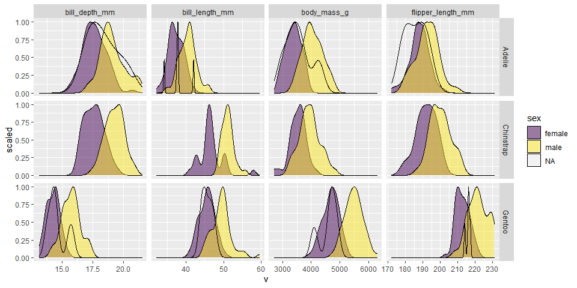
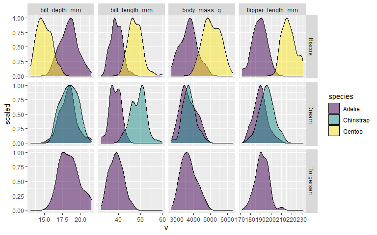
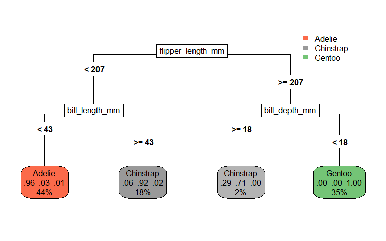

Palmer Penguins
================

## TidyTuesday \[2020-07-28\]

``` r
library(palmerpenguins)
library(tidyverse)
```

A quick look at the tidied data set

``` r
palmerpenguins::penguins
#> # A tibble: 344 x 8
#>    species island bill_length_mm bill_depth_mm flipper_length_~ body_mass_g
#>    <fct>   <fct>           <dbl>         <dbl>            <int>       <int>
#>  1 Adelie  Torge~           39.1          18.7              181        3750
#>  2 Adelie  Torge~           39.5          17.4              186        3800
#>  3 Adelie  Torge~           40.3          18                195        3250
#>  4 Adelie  Torge~           NA            NA                 NA          NA
#>  5 Adelie  Torge~           36.7          19.3              193        3450
#>  6 Adelie  Torge~           39.3          20.6              190        3650
#>  7 Adelie  Torge~           38.9          17.8              181        3625
#>  8 Adelie  Torge~           39.2          19.6              195        4675
#>  9 Adelie  Torge~           34.1          18.1              193        3475
#> 10 Adelie  Torge~           42            20.2              190        4250
#> # ... with 334 more rows, and 2 more variables: sex <fct>, year <int>
```

## Measurements split by sex and species

``` r
palmerpenguins::penguins %>%  
  gather(k, v, -species, -island, -sex, -year) %>% 
  ggplot(aes(v))+
  geom_density(aes(y=..scaled.., fill=sex), alpha=1/2)+
  facet_grid(species ~ k, scales="free")+
  scale_fill_viridis_d()
#> Warning: Removed 8 rows containing non-finite values (stat_density).
```

<!-- -->

  - Males bigger than females
  - Some observations with NA sex

## Measurements split by island and species

``` r
palmerpenguins::penguins %>%  
  gather(k, v, -species, -island, -sex, -year) %>% 
  ggplot(aes(v))+
  geom_density(aes(y=..scaled.., fill=species), alpha=1/2)+
  facet_grid(island ~ k, scales="free")+
  scale_fill_viridis_d()
#> Warning: Removed 8 rows containing non-finite values (stat_density).
```

<!-- -->

  - Adelie on all three islands and no difference in distributions
    between islands.
  - Chinstrap unique to Dream Island and Gentoo unique to Biscoe.
  - Gentoo bigger than Adelie (and biggest overall) **BUT** smaller bill
    depth\!
  - Chinstrap similar to Adelie but much bigger bill length\!

## Classifier

Build classifier from **all data** just for fun (I am not training a
model and evaluating performance here\!)

``` r
rpart::rpart(data = palmerpenguins::penguins %>% select(-island),
             formula = species ~ .,
             model = TRUE) %>% 
  rpart.plot::rpart.plot(type=5)
```

<!-- -->
