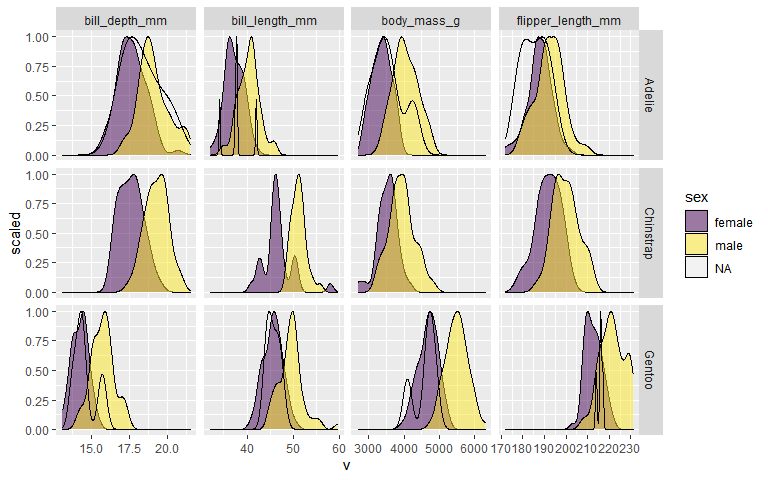
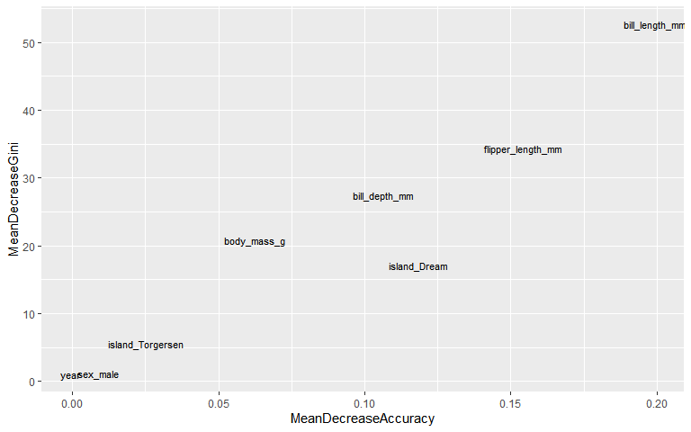
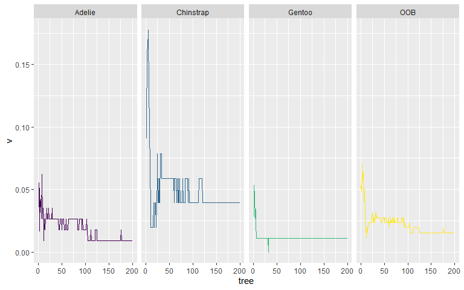

Palmer Penguins
================

## TidyTuesday \[2020-07-28\]

``` r
library(palmerpenguins)
library(tidyverse)
```

A quick look at the tidied data set

``` r
palmerpenguins::penguins
#> # A tibble: 344 x 8
#>    species island bill_length_mm bill_depth_mm flipper_length_~ body_mass_g
#>    <fct>   <fct>           <dbl>         <dbl>            <int>       <int>
#>  1 Adelie  Torge~           39.1          18.7              181        3750
#>  2 Adelie  Torge~           39.5          17.4              186        3800
#>  3 Adelie  Torge~           40.3          18                195        3250
#>  4 Adelie  Torge~           NA            NA                 NA          NA
#>  5 Adelie  Torge~           36.7          19.3              193        3450
#>  6 Adelie  Torge~           39.3          20.6              190        3650
#>  7 Adelie  Torge~           38.9          17.8              181        3625
#>  8 Adelie  Torge~           39.2          19.6              195        4675
#>  9 Adelie  Torge~           34.1          18.1              193        3475
#> 10 Adelie  Torge~           42            20.2              190        4250
#> # ... with 334 more rows, and 2 more variables: sex <fct>, year <int>
```

## Measurements split by sex and species

``` r
palmerpenguins::penguins %>%  
  gather(k, v, -species, -island, -sex, -year) %>% 
  ggplot(aes(v))+
  geom_density(aes(y=..scaled.., fill=sex), alpha=1/2)+
  facet_grid(species ~ k, scales="free")+
  scale_fill_viridis_d()
#> Warning: Removed 8 rows containing non-finite values (stat_density).
```

<!-- -->

  - Males bigger than females
  - Some observations with NA sex

## Measurements split by island and species

``` r
palmerpenguins::penguins %>%  
  gather(k, v, -species, -island, -sex, -year) %>% 
  ggplot(aes(v))+
  geom_density(aes(y=..scaled.., fill=species), alpha=1/2)+
  facet_grid(island ~ k, scales="free")+
  scale_fill_viridis_d()
#> Warning: Removed 8 rows containing non-finite values (stat_density).
```

<!-- -->

  - Adelie on all three islands and no difference in distributions
    between islands.
  - Chinstrap unique to Dream Island and Gentoo unique to Biscoe.
  - Gentoo bigger than Adelie (and biggest overall) **BUT** smaller bill
    depth\!
  - Chinstrap similar to Adelie but much bigger bill length\!

## Simple classifier

Build classifier from **all data** just for fun (I am not training a
model and evaluating performance here\!)

``` r
rpart::rpart(data = palmerpenguins::penguins %>% select(-island),
             formula = species ~ .,
             model = TRUE) %>% 
  rpart.plot::rpart.plot(type=5)
```

<!-- -->

  - These splits appear sensible based on a visual inspection of the
    density distributions above

## Full random forest

``` r
library(tidymodels)
```

Split the data

``` r
set.seed(4)
split <- rsample::initial_split(palmerpenguins::penguins, strata = species)
```

``` r
# Check propotions in original and training/test sets
palmerpenguins::penguins$species %>% table() %>% prop.table()
#> .
#>    Adelie Chinstrap    Gentoo 
#> 0.4418605 0.1976744 0.3604651
training(split)$species %>% table() %>% prop.table()
#> .
#>    Adelie Chinstrap    Gentoo 
#> 0.4418605 0.1976744 0.3604651
testing(split)$species %>% table() %>% prop.table()
#> .
#>    Adelie Chinstrap    Gentoo 
#> 0.4418605 0.1976744 0.3604651
```

### Deinfe model with `parsnip`

Define a random forest model using `randomForest`

``` r
my_model <- 
  parsnip::rand_forest(mode = "classification", trees = 200) %>% 
  parsnip::set_engine("randomForest", importance = TRUE, do.trace = 20)
```

### Define recipe with `recipes`

``` r
my_recipe <-
  recipes::recipe(species ~ ., data = palmerpenguins::penguins) %>% 
  step_meanimpute(all_numeric()) %>% 
  step_modeimpute(all_nominal(), -all_outcomes()) %>% 
  step_dummy(all_nominal(), -all_outcomes())
```

### Create workflow and fit model

``` r
# Create a workflow   
my_wf <-
  workflow() %>% 
  add_model(my_model) %>% 
  add_recipe(my_recipe)

# Create the random foresr model on the training data
rf_fit <- parsnip::fit(my_wf, data=training(split))
#> ntree      OOB      1      2      3
#>    20:   2.33%  2.63%  3.92%  1.08%
#>    40:   2.71%  2.63%  5.88%  1.08%
#>    60:   1.94%  1.75%  3.92%  1.08%
#>    80:   2.33%  2.63%  3.92%  1.08%
#>   100:   1.94%  1.75%  3.92%  1.08%
#>   120:   1.94%  0.88%  5.88%  1.08%
#>   140:   1.55%  0.88%  3.92%  1.08%
#>   160:   1.55%  0.88%  3.92%  1.08%
#>   180:   1.55%  0.88%  3.92%  1.08%
#>   200:   1.55%  0.88%  3.92%  1.08%
```

### Visualise fit

View variable importance

``` r
# Extract model and plot importance
rfmod <- rf_fit$fit$fit$fit
rfmod %>% randomForest::varImpPlot()
```

<!-- -->

``` r

rfmod$importance %>% 
  as.data.frame() %>% 
  rownames_to_column() %>% 
  ggplot(aes(MeanDecreaseAccuracy, MeanDecreaseGini))+
  geom_text(aes(label = rowname), size=3)
```

<!-- -->

View error rates on out of bag (OOB) observations

``` r
rfmod$err.rate %>% 
  as_tibble() %>% 
  mutate(tree = row_number()) %>% 
  gather(k, v, -tree) %>% 
  ggplot(aes(tree, v, col=k))+
  geom_line()+
  facet_wrap(~k, nrow=1)+
  theme(legend.position = "")
```

<!-- -->

### Predict on testing set

``` r
class_pred <-
  predict(rf_fit, new_data = testing(split), type = "class") %>% 
  cbind(testing(split))
```

Measuring performance of the class measure

``` r
metricset <- 
  yardstick::metric_set(sens, 
                        spec, 
                        ppv, 
                        npv, 
                        accuracy, 
                        bal_accuracy, 
                        recall)

metricset(class_pred, truth = species, estimate = .pred_class)
#> # A tibble: 7 x 3
#>   .metric      .estimator .estimate
#>   <chr>        <chr>          <dbl>
#> 1 sens         macro          0.991
#> 2 spec         macro          0.995
#> 3 ppv          macro          0.981
#> 4 npv          macro          0.993
#> 5 accuracy     multiclass     0.988
#> 6 bal_accuracy macro          0.993
#> 7 recall       macro          0.991

yardstick::conf_mat(class_pred, truth = species, estimate = .pred_class)
#>            Truth
#> Prediction  Adelie Chinstrap Gentoo
#>   Adelie        37         0      0
#>   Chinstrap      1        17      0
#>   Gentoo         0         0     31
```
