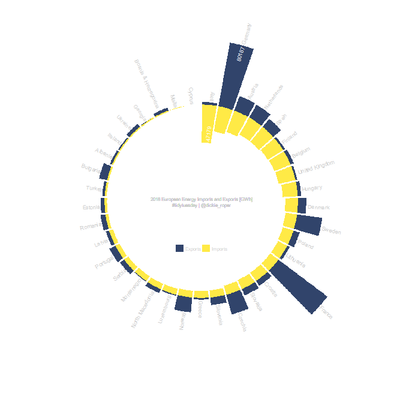
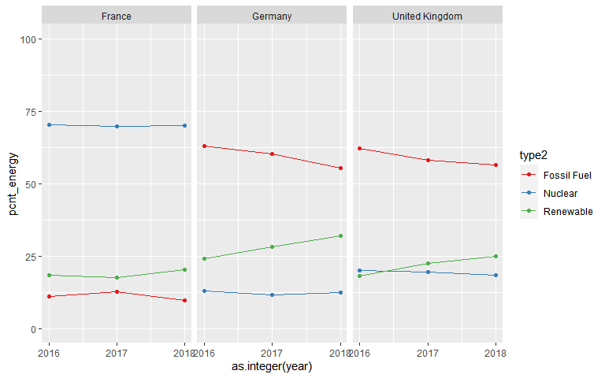

European Energy
================

## TidyTuesday \[2020-08-04\]

``` r
library(tidyverse)
```

Read in data

``` r
d <- tidytuesdayR::tt_load("2020-08-04")
#> --- Compiling #TidyTuesday Information for 2020-08-04 ----
#> --- There are 2 files available ---
#> --- Starting Download ---
#> 
#>  Downloading file 1 of 2: `energy_types.csv`
#>  Downloading file 2 of 2: `country_totals.csv`
#> --- Download complete ---

glimpse(d$energy_types)
#> Rows: 296
#> Columns: 7
#> $ country      <chr> "BE", "BE", "BE", "BE", "BE", "BE", "BE", "BE", "BG", ...
#> $ country_name <chr> "Belgium", "Belgium", "Belgium", "Belgium", "Belgium",...
#> $ type         <chr> "Conventional thermal", "Nuclear", "Hydro", "Pumped hy...
#> $ level        <chr> "Level 1", "Level 1", "Level 1", "Level 2", "Level 1",...
#> $ `2016`       <dbl> 30728.00, 41430.00, 1476.00, 1110.00, 5340.00, 3070.00...
#> $ `2017`       <dbl> 31316.000, 40128.500, 1360.900, 1093.200, 6387.900, 32...
#> $ `2018`       <dbl> 30092.635, 26995.628, 1239.248, 983.190, 7177.346, 348...
glimpse(d$country_totals)
#> Rows: 185
#> Columns: 7
#> $ country      <chr> "BE", "BE", "BE", "BE", "BE", "BG", "BG", "BG", "BG", ...
#> $ country_name <chr> "Belgium", "Belgium", "Belgium", "Belgium", "Belgium",...
#> $ type         <chr> "Total net production", "Imports", "Exports", "Energy ...
#> $ level        <chr> "Total", "Total", "Total", "Total", "Total", "Total", ...
#> $ `2016`       <dbl> 82520.000, 14648.000, 8465.000, 1475.000, 87228.000, 4...
#> $ `2017`       <dbl> 82948.500, 14189.400, 8167.800, 1485.400, 87484.700, 4...
#> $ `2018`       <dbl> 69212.347, 21635.908, 4308.347, 1347.901, 85192.007, 4...
```

## Imports/Exports

My first thought is to take a look at the difference between how much
energy is imported vs exported per country.

I am obsessed with bar charts in polar coordinates at the moment (I have
no idea why - style over substance\!). Here I will begin by re-defining
`coord_munch()` in order to have higher resolution polygons when using
polar coordinates. This hack is taken from
[here](https://stackoverflow.com/questions/9483033/increase-polygonal-resolution-of-ggplot-polar-plots)

``` r
# Save the original version of coord_munch
coord_munch_old <- ggplot2:::coord_munch

# Make a wrapper function that has a different default for segment_length
coord_munch_new <- function(coord, data, range, segment_length = 1/500) {
  coord_munch_old(coord, data, range, segment_length)
}

# Make the new function run in the same environment
environment(coord_munch_new) <- environment(ggplot2:::coord_munch)

# Replace ggplot2:::coord_munch with coord_munch_new
assignInNamespace("coord_munch", coord_munch_new, ns="ggplot2")
```

Wrangle import and export values

``` r
ie_data <-
  d$country_totals %>%
  mutate(country_name = case_when(is.na(country_name) ~ "United Kingdom",
                                  
                                  TRUE ~ country_name)) %>% 
  pivot_longer(cols=c("2016", "2017", "2018"), names_to = "year") %>% 
  pivot_wider(names_from = "type", values_from = "value") %>% 
  mutate(ie = Imports/Exports) %>%
  filter(year == "2018") %>%
  arrange(desc(Imports)) %>% 
  mutate(country = fct_inorder(country)) %>% 
  mutate(import_label = case_when(Imports == max(Imports) ~ round(Imports),
                                  TRUE ~ NA_real_),
         export_label = case_when(Exports == max(Exports) ~ round(Exports),
                                  TRUE ~ NA_real_))

# The angle specification is messy
# 37 bars so we move in angle steps of (360/37)
# BUT the 12 o'clock position on th eplot splits the last and first bar
# so the first text label (on first bar to the right of 12 o'clock) needs to be 
# rotated by only HALF of the angle step (360/37)/2
angles <- seq(90-((360/37)/2), by=-360/37, l=37)
hjusts <- ifelse(between(angles, -90, 90), -0.05, 1.05) 
angles[angles < -90] <- angles[angles < -90] + 180
```

Visualise\!

``` r
ie_data %>% 
  ggplot()+
  geom_col(aes(country, Exports, fill = "Exports"), alpha=1)+
  geom_text(aes(country, Exports, label = export_label, angle=angles), size=2.5, hjust=1.1, col="white")+
  geom_col(aes(country, -Imports, fill = "Imports"), alpha=1)+
  geom_text(aes(country, -Imports, label = import_label, angle=angles), size=2.5, hjust=-0.1, col="white")+
  
  geom_text(aes(country, Exports, label=country_name, angle=angles, 
                hjust=hjusts), col="grey80", size=2.5)+
  
  # geom_errorbar(aes(x=country, ymin=0, ymax=Imports, col="Imports"),
  #              size=0.5, linetype=1, alpha=1/2, width=0.5, show.legend = FALSE)+
  
  # facet_wrap(~year)+
  
  expand_limits(y = -120000)+
  scale_fill_manual("",
                    values=c(Exports = viridis::cividis(2, begin=0.2)[1],
                             Imports = viridis::cividis(2, begin=0.2)[2]))+

  theme_void()+
  theme(panel.grid.major.y = element_blank(),
        panel.grid.major.x = element_blank(),
        axis.title = element_blank(),
        axis.text = element_blank(),
        axis.ticks.y = element_blank(),
        # panel.background = element_rect(fill="grey50", colour=NA),
        # plot.background = element_rect(fill="grey50", colour = NA),
        legend.position = c(0.5, 0.4),
        legend.key.size = unit(0.15, "inch"),
        legend.text = element_text(size=2*.pt, color="grey80"),
        legend.spacing.x = unit(0.02, "inch")
        # legend.position = "bottom"
        # plot.title = element_text(color="white"),
        # plot.subtitle = element_text(color="white")
        )+
  
  coord_polar()+
  guides(fill = guide_legend(nrow = 1))+
  
  geom_text(x=0.5, y=-120000, 
            label = "2018 European Energy Imports and Exports [GWh]\n#tidytuesday | @dickie_roper",
            size=2, col="grey80")
#> Warning: Removed 36 rows containing missing values (geom_text).

#> Warning: Removed 36 rows containing missing values (geom_text).
```

<!-- -->

``` r
  
  # geom_hline(yintercept = 0, col = "white", size = 0.1)

ggsave("imports-exports.pdf", width=7, height=7)
#> Warning: Removed 36 rows containing missing values (geom_text).

#> Warning: Removed 36 rows containing missing values (geom_text).
ggsave("imports-exports.png", width=7, height=7)
#> Warning: Removed 36 rows containing missing values (geom_text).

#> Warning: Removed 36 rows containing missing values (geom_text).
```

## Change in production with time

Currently a work in progress

``` r
et <- 
  d$energy_types %>% 
  mutate(country_name = case_when(is.na(country_name) ~ "United Kingdom",
                                  TRUE ~ country_name))

et %>% 
  pivot_longer(cols=c("2016", "2017", "2018"), names_to = "year") %>% 
  group_by(country) %>% 
  summarise(total_production = sum(value)) %>% 
  top_n(3, total_production) %>%
  inner_join(et) %>% 
  pivot_longer(cols=c("2016", "2017", "2018"), names_to = "year") %>% 
  mutate(type2 = case_when(type == "Conventional thermal" ~ "Fossil Fuel",
                           type %in% c("Hydro", 
                                       "Pumped hydro power", 
                                       "Wind", 
                                       "Solar", 
                                       "Geothermal",
                                       "Other") ~ "Renewable",
                           TRUE ~ type)) %>% 
  group_by(year, country, country_name, type2) %>%
  summarise(energy = sum(value)) %>% 
  mutate(total_energy = sum(energy),
         pcnt_energy = energy / total_energy * 100) %>% 
  ggplot(aes(as.integer(year), pcnt_energy, col=type2))+
  geom_line()+
  geom_point()+
  facet_wrap(~country_name, nrow=1)+
  scale_x_continuous(breaks=2016:2018)+
  expand_limits(y=c(0,100))+
  scale_colour_brewer(palette = "Set1")
#> `summarise()` ungrouping output (override with `.groups` argument)
#> Joining, by = "country"
#> `summarise()` regrouping output by 'year', 'country', 'country_name' (override with `.groups` argument)
```

<!-- -->
